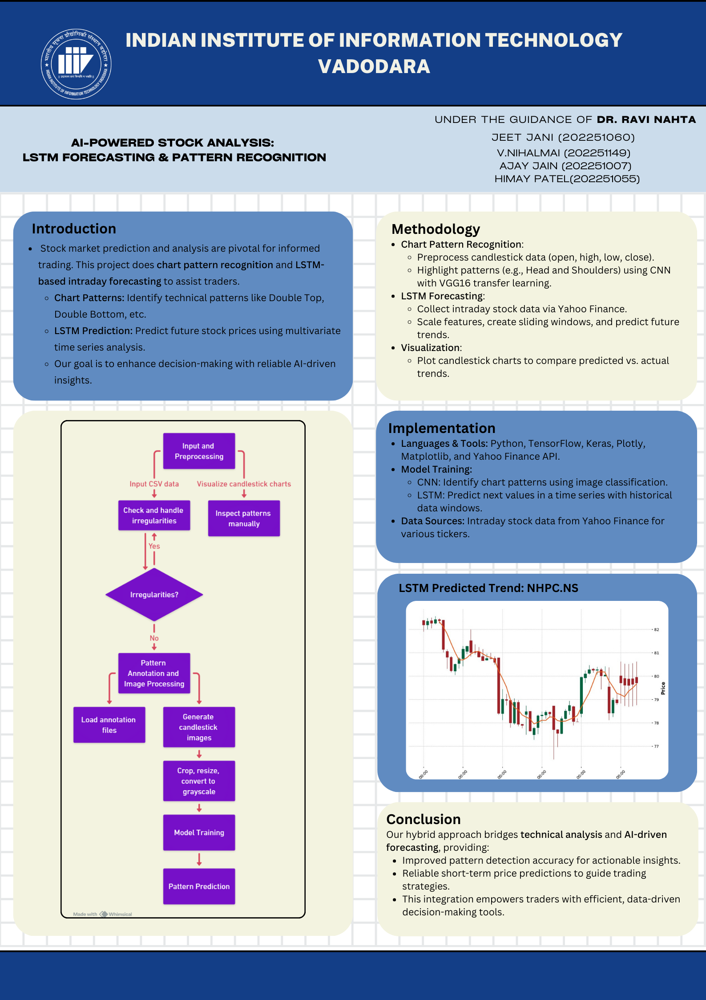

# Stock Market Prediction Using LSTM and Chart Pattern Recognition

## Project Overview
This project explores independent approaches for stock market prediction using chart pattern recognition and LSTM networks. The report provides insights into the methodology and results.

## Contributors
- Ajay Jain (202251007)
- Himay Patel (202251055)
- Jeet Jani (202251060)
- V. Nihalmai (202251149)

## Supervisor
Dr. Ravi Natha

## Full Report
[Download the Full Report](DesignProject.pdf)
